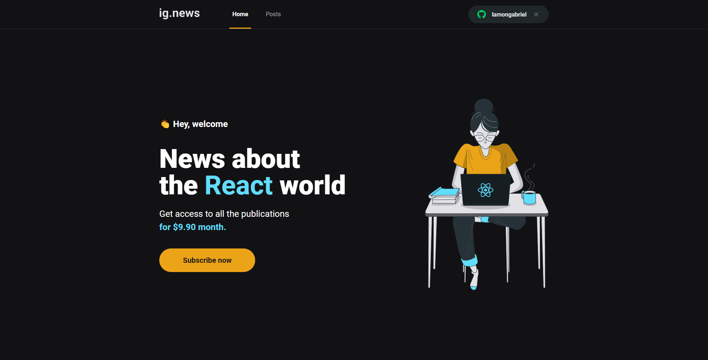
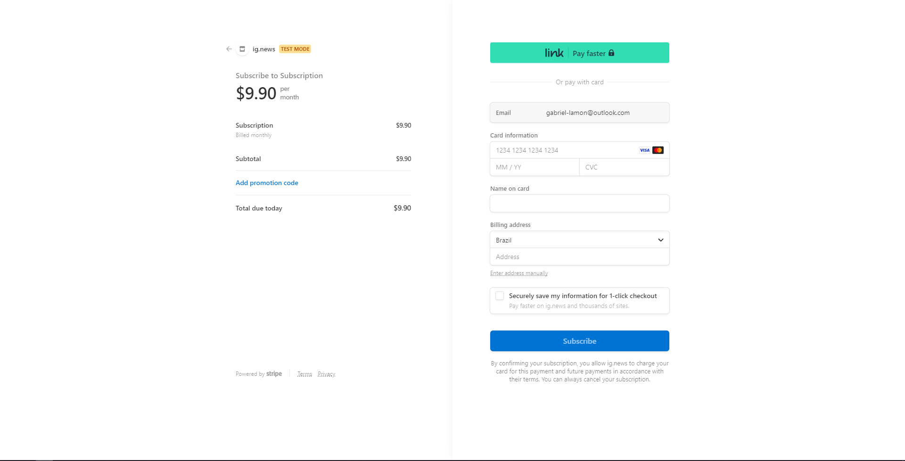

<!-- PROJECT LOGO -->
<br />
<div align="center">
  <a>
    
  </a>

  <h3 align="center">ig.news</h3>

  <p align="center">
    An awesome subscription-blog service to learn the everydays news about the react world.
  </p>
</div>

<!-- ABOUT THE PROJECT -->
## About The Project

[https://ignews-lamongabriel.vercel.app/](https://ignews-lamongabriel.vercel.app/)

<div align="center">
	
	<br>
	<br>
</div>

A subscription service made with NextJS, built for SEO indexation, with GitHub authentication, Stripe for payments and PRISMIC CMS for creating page Docs.

Every page as a preview if the user is not logged in and the user must be an active subscriber to see the whole article. The payment system is made via Stripe, where the user can will be redirected to if an active subscription plan is not detected.

The project also makes use of FaunaDB, so it can handle users login data and plans. Fauna just stores users id and subscription data, if it's active or not.

<div align="center">
	
	<br>
	<br>
</div>

Made with Stripe you can safely and reliably make payments, store credit-card data, and use 1 click purchase. The service comes with a monthly-subscription payment type, so every month stripes handles the billing.

### Testing the Payment API 💲

As TEST mode is activated, you can use a fake card to test the payment system without using your real money.

```bash
# Stripe comes with a fake card that you can use.

# Card Number
4242 4242 4242 4242
```

All other info can be random, you can input whatever you want.

<div align="center">
	
	<br>
	<br>
</div>

### Built With 💻

Developed with a focus of google indexation and a easy post creation, this project makes use of the following techonologies:

<ul>
	<li> NextJS
	<li> ReactJS
	<li> TypeScript
	<li> Next Auth
	<li> Prismic CMS
	<li> Stripe Payments
	<li> Fauna DB
	<li> SCSS
	<li> EsLint
</ul>


<!-- GETTING STARTED -->
## Getting Started ⚙

You must have a package manager installed in your machine (i recommend NPM or PNPM) and NodeJs, you can follow their documentation here: [Node](https://nodejs.org/en/docs/guides/getting-started-guide/)

### 1. You must set .env variables for Stripe

You can follow their documentation on how to get started and manage an account.
[Stripe Docs](https://stripe.com/docs/development/get-started)

```bash

STRIPE_API_KEY=
STRIPE_WEBHOOK_SECRET=
STRIPE_SUCCESS_URL=
STRIPE_CANCEL_URL=

NEXT_PUBLIC_STRIPE_PUBLIC_KEY=
```

### 2. You must set .env variables for GitHub OAuth

You just need two simple variables, when creating a project it's sent to you in the first page, check it out here:
[Authorizing OAuth Apps](https://docs.github.com/en/developers/apps/building-oauth-apps/authorizing-oauth-apps)

```bash

GITHUB_ID=
GITHUB_SECRET=
```

### 3. You must set .env variables for Fauna DB

Create a collection and get the private key, then use it here.
[Fauna Docs](https://docs.fauna.com/fauna/current/learn/quick_start/quick_starts)

```bash

FAUNADB_KEY=
```

### 4. You must set .env variables for Prismic CMS

Create an account in Prismic, create your project, set the API as private, and get the key.
[Prismic API Docs](https://prismic.io/docs/api)

```bash

PRISMIC_ACCESS_TOKEN=
```

### 5. Deploy 🌟

Using vercel, it's straight-forward. Just upload the project and set the environment variables via the website GUI
[Deploy with NextJS](https://vercel.com/guides/deploying-nextjs-with-vercel)
