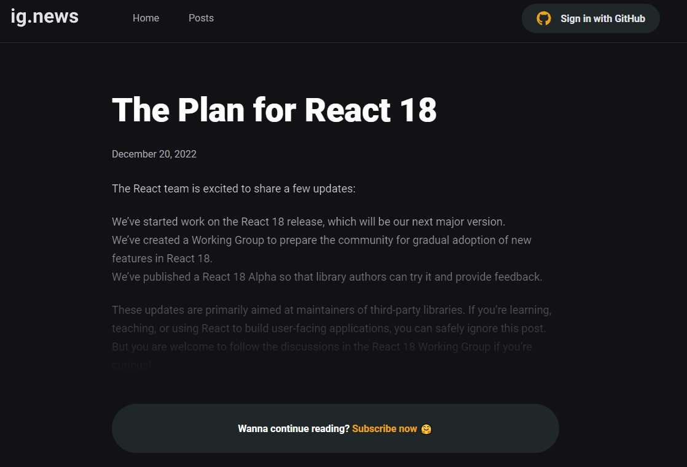

<!-- PROJECT LOGO -->
 

  

  <h3 align="center">ig.news</h3>

  

    An awesome subscription-blog service to learn the everydays news about the react world.
  

<!-- ABOUT THE PROJECT -->
## About The Project 👌

	
	 
	 

A subscription service made with NextJS, built for SEO indexation, with GitHub authentication, Stripe for payments and PRISMIC CMS for creating page Docs.

Every page as a preview if the user is not logged in and the user must be an active subscriber to see the whole article. The payment system is made via Stripe, where the user can will be redirected to if an active subscription plan is not detected.

The project also makes use of FaunaDB, so it can handle users login data and plans. Fauna just stores users id and subscription data, if it's active or not.

	
	 
	 

### Built With 💻

Developed with a focus of google indexation and a easy post creation, this project makes use of the following techonologies:

<ul>
	<li> NextJS
	<li> ReactJS
	<li> TypeScript
	<li> Next Auth
	<li> Prismic CMS
	<li> Stripe Payments
	<li> Fauna DB
	<li> SCSS
	<li> EsLint
</ul>

<!-- GETTING STARTED -->
## Getting Started ⚙

You must have a package manager installed in your machine (i recommend yarn) and NodeJs, you can follow their documentation here: [Node](https://nodejs.org/en/docs/guides/getting-started-guide/) and [Yarn](https://classic.yarnpkg.com/lang/en/docs/getting-started/).
